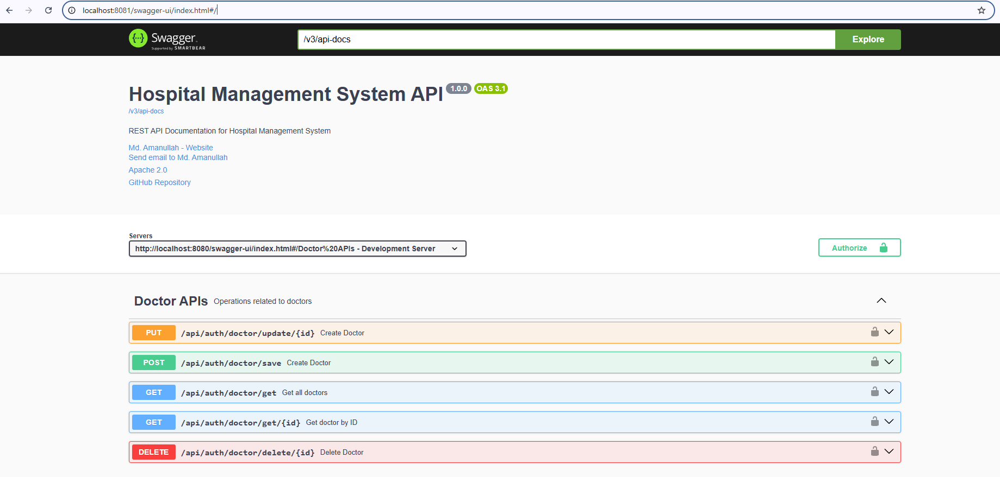
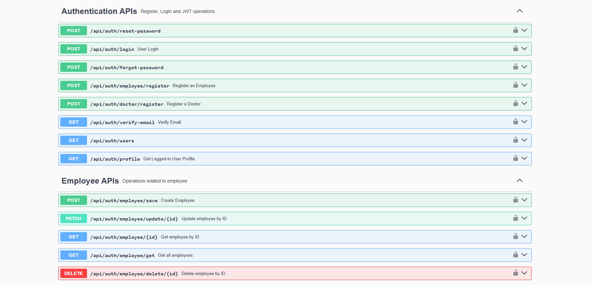
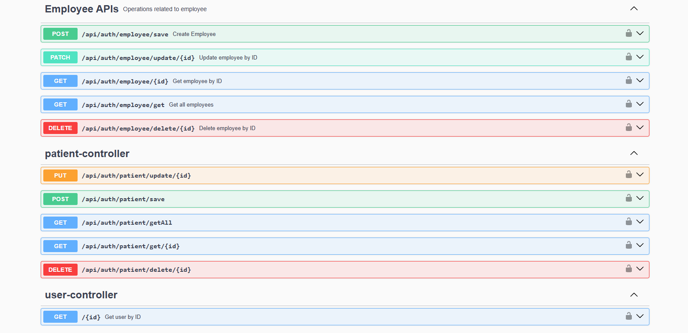
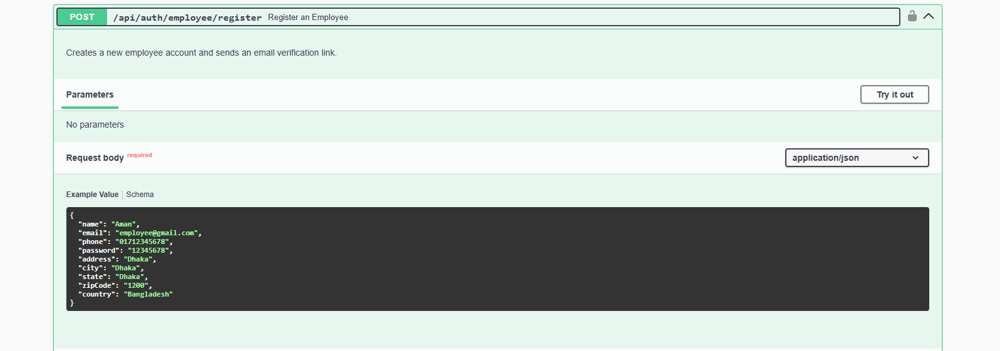
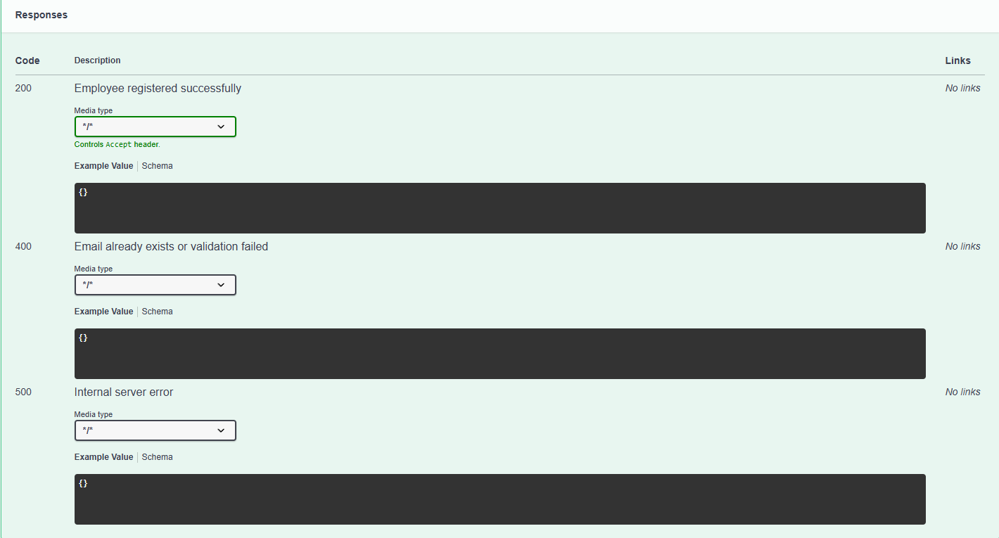
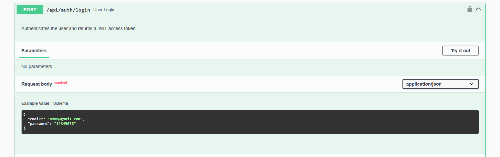
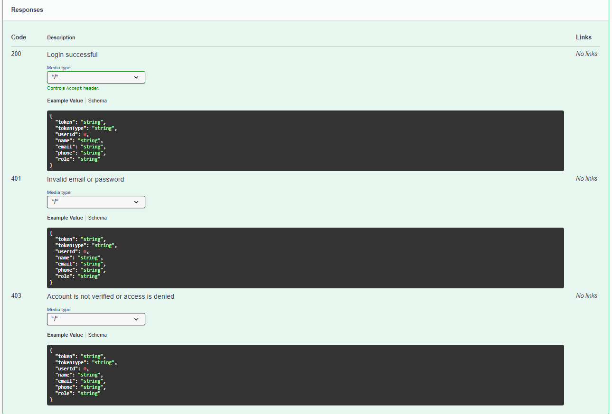
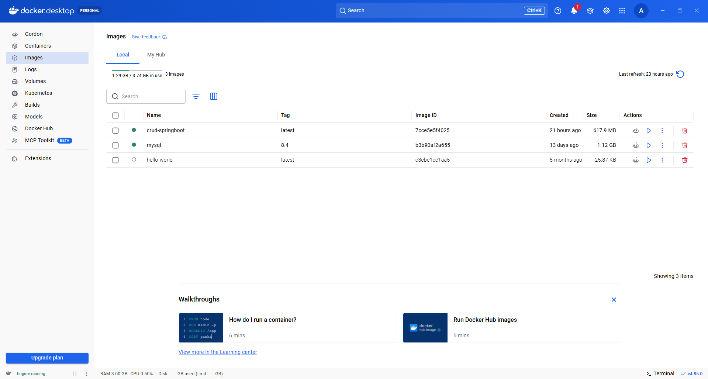

# 🚀 CRUD Backend API

A professional **Spring Boot Backend Project** created as a practical learning and testing environment for developing, testing, and refining modern backend engineering concepts.

The project focuses on building a secure and maintainable REST API using **Java 21, Spring Boot, Spring Security, JWT, Refresh Tokens, Hibernate/JPA, MySQL, DTOs, Validation, Global Exception Handling, Swagger/OpenAPI, Docker, JUnit, and Mockito**.

This project is intentionally designed as an evolving backend engineering project where new technologies and production-oriented practices are continuously explored and integrated.

---

# 📌 Project Overview

**CRUD Backend API** is a backend-only Spring Boot application developed primarily for learning, experimentation, testing, and improving practical backend development skills.

The project includes multiple CRUD-based modules such as:

* 👤 User
* 🧑‍⚕️ Patient
* 👨‍⚕️ Doctor
* 👨‍💼 Employee

Alongside CRUD functionality, the project implements a complete authentication and security foundation including:

* Email Verification
* Forgot Password
* Reset Password
* JWT Authentication
* Refresh Token
* Role-Based Security
* Request Validation
* Centralized Exception Handling
* DTO-Based API Design
* Centralized Database Design

---

# 🎯 Project Purpose

The primary purpose of this project is **not to represent a finished business product**.

Instead, it is a dedicated backend development environment for:

* Learning new backend technologies
* Testing architectural approaches
* Practicing Spring Boot development
* Understanding Spring Security
* Implementing authentication flows
* Improving database design
* Practicing REST API development
* Writing unit tests
* Containerizing applications with Docker
* Preparing for production deployment

The project will continue to evolve as new backend technologies are learned and integrated.

---

# ✨ Implemented Features

## 🔐 Authentication & Security

The project contains a complete authentication foundation.

### User Registration

* User registration
* Request validation
* Password encryption
* Role assignment
* Account verification workflow

### 📧 Email Verification

* Verification email
* Verification token
* Account verification
* Secure verification workflow

### 🔑 JWT Authentication

* JWT-based authentication
* Access Token generation
* Bearer Token authentication
* Protected REST APIs
* JWT authentication filter

### 🔄 Refresh Token

* Refresh Token generation
* Access Token renewal
* Refresh Token validation
* Token lifecycle management

### 🚪 Logout / Token Management

* Logout workflow
* Refresh Token invalidation/revocation
* Secure token lifecycle management

---

# 🔑 Forgot Password

The project implements a password recovery workflow.

```text
Forgot Password Request
        ↓
Enter Email
        ↓
Generate Reset Token
        ↓
Send Reset Email
        ↓
User Opens Reset Link
        ↓
Validate Reset Token
        ↓
Set New Password
        ↓
Encrypt Password
        ↓
Update User
```

---

# 🔄 Reset Password

Users can securely reset their password through the password reset flow.

The new password is encrypted before being stored in the database.

```text
New Password
     ↓
Validation
     ↓
BCrypt Password Encoding
     ↓
Database
```

---

# 👥 CRUD Modules

The project contains CRUD-based backend modules for different domain entities.

## 👤 User

Typical operations:

```text
Create
Read
Update
Delete
```

## 🧑‍⚕️ Patient

Patient-related CRUD operations and API design.

## 👨‍⚕️ Doctor

Doctor-related CRUD operations and API design.

## 👨‍💼 Employee

Employee-related CRUD operations and API design.

---

# 🗄️ Centralized Database Design

One of the main learning goals of this project is designing the database in a **centralized and consistent way**.

The backend uses:

* MySQL
* Hibernate
* JPA
* Entity Relationships
* Repository-based data access

The database layer is designed to maintain clear relationships between application entities and reduce unnecessary duplication.

---

# 🏗️ Backend Architecture

The project follows a layered architecture.

```text
Client
  │
  ▼
Controller
  │
  ▼
Service
  │
  ▼
Repository
  │
  ▼
Database
```

Supporting layers:

```text
Backend
│
├── Controller
├── Service
├── Repository
├── Entity
├── DTO
│   ├── Request
│   └── Response
├── Mapper
├── Security
├── Validation
├── Exception
└── Configuration
```

---

# 📦 DTO-Based API Design

The project separates API models from database entities using DTOs.

### Request Flow

```text
Client
  ↓
Request DTO
  ↓
Controller
  ↓
Service
  ↓
Entity
  ↓
Repository
```

### Response Flow

```text
Database
  ↓
Entity
  ↓
Service
  ↓
Response DTO
  ↓
Controller
  ↓
Client
```

---

# 📊 CRUD DTO Pattern

The project follows a consistent Request/Response DTO approach.

| Operation | Request DTO | Response DTO |
| --------- | ----------: | -----------: |
| Save      |           ✅ |            ✅ |
| Get All   |           ❌ |            ✅ |
| Get By ID |           ❌ |            ✅ |
| Update    |           ✅ |            ✅ |
| Delete    |           ❌ |     Optional |

This keeps the persistence model separated from the API contract.

---

# 🛡️ Validation

The project uses request validation to prevent invalid data from entering the application layer.

Typical validation responsibilities include:

* Required fields
* Valid email format
* Password validation
* Input constraints
* Request-level validation

Validation is handled before business logic is executed.

---

# ⚠️ Global Exception Handling

The project follows a centralized exception-handling approach.

Instead of handling every exception independently inside every controller, errors are handled through a centralized mechanism.

Typical scenarios include:

* Resource Not Found
* Validation Errors
* Authentication Errors
* Authorization Errors
* Invalid Requests
* Duplicate Data
* Business Exceptions
* Database-related Exceptions

This provides a consistent API error-response structure.

---

# 🔒 Spring Security

Security is implemented using **Spring Security**.

The security architecture includes:

```text
Spring Security
      │
      ├── Authentication
      │
      ├── Authorization
      │
      ├── JWT Filter
      │
      ├── Role-Based Access
      │
      └── Protected Endpoints
```

---

# 👮 Role-Based Authorization

The application supports role-based access control.

Users can be assigned roles, and protected APIs can be restricted according to those roles.

Example:

```text
ADMIN
DOCTOR
PATIENT
EMPLOYEE
```

> Exact roles and endpoint permissions depend on the current implementation and can evolve as the project develops.

---

# 🔌 REST API Design

The project follows REST-oriented API design principles.

Typical CRUD API structure:

```text
POST    /api/resource
GET     /api/resource
GET     /api/resource/{id}
PUT     /api/resource/{id}
DELETE  /api/resource/{id}
```

The API uses appropriate HTTP methods and separates request and response representations through DTOs.

---

# 📖 Swagger / OpenAPI

The project includes **Swagger/OpenAPI** for API documentation and testing.

Swagger provides an interactive interface where APIs can be:

* Viewed
* Explored
* Tested
* Documented

This makes backend API development and testing easier during development.

---

# 🧪 Testing

Testing is an important part of this project.

The project uses:

* **JUnit**
* **Mockito**

Testing areas include:

* Service layer
* Business logic
* CRUD operations
* Exception scenarios
* Validation-related behavior
* Mocked dependencies

---

# 🐳 Docker

The application is containerization-ready using Docker.

Docker helps create a consistent environment for:

```text
Application
     ↓
Docker Container
     ↓
Consistent Runtime Environment
```

This also prepares the project for future CI/CD and cloud deployment.

---

## 📚 API Documentation

This project uses Swagger/OpenAPI for REST API documentation and interactive API testing.

When the application is running locally, the following endpoints are available:

| Documentation   | URL                                           |
| --------------- | --------------------------------------------- |
| 📖 Swagger UI   | `http://localhost:8081/swagger-ui/index.html` |
| 📄 OpenAPI JSON | `http://localhost:8081/v3/api-docs`           |


## Swagger UI
Swagger UI provides an interactive interface for exploring and testing the REST APIs.


**Note:** These URLs are available only when the application is running locally. They are not public/live endpoints.

---

## 📸 Screenshots

### 📚 Swagger / OpenAPI




### 👥 CRUD APIs





### 🐳 Docker


---


# 🛠️ Technology Stack

| Technology                | Purpose                        |
| ------------------------- | ------------------------------ |
| Java 21                   | Programming Language           |
| Spring Boot               | Backend Framework              |
| Spring Security           | Authentication & Authorization |
| JWT                       | Token-Based Authentication     |
| Refresh Token             | Token Renewal                  |
| Hibernate                 | ORM                            |
| JPA                       | Persistence API                |
| MySQL                     | Relational Database            |
| REST API                  | Client-Server Communication    |
| DTO                       | API Data Transfer              |
| Validation                | Input Validation               |
| Global Exception Handling | Centralized Error Handling     |
| Swagger / OpenAPI         | API Documentation              |
| JUnit                     | Unit Testing                   |
| Mockito                   | Mock Testing                   |
| Docker                    | Containerization               |
| Maven                     | Build & Dependency Management  |

---

# ☕ Java Environment

```text
Java Version:
21.0.10 LTS

Java(TM) SE Runtime Environment:
21.0.10+8-LTS-217

Java HotSpot(TM) 64-Bit Server VM:
21.0.10+8-LTS-217
```

---

# 🔄 Authentication Flow

```text
User
 ↓
Register
 ↓
Email Verification
 ↓
Account Activated
 ↓
Login
 ↓
Access Token + Refresh Token
 ↓
Protected API
 ↓
JWT Authentication
 ↓
Role-Based Authorization
```

---

# 🔄 Refresh Token Flow

```text
Login
  ↓
Access Token
+
Refresh Token
  ↓
Access Token Expires
  ↓
Refresh Token Request
  ↓
Validate Refresh Token
  ↓
Generate New Access Token
```

---

# 🧩 Backend Request Lifecycle

```text
HTTP Request
     ↓
Controller
     ↓
Validation
     ↓
Request DTO
     ↓
Service
     ↓
Business Logic
     ↓
Repository
     ↓
Database
     ↓
Entity
     ↓
Mapper
     ↓
Response DTO
     ↓
HTTP Response
```

---

# 📂 Recommended Project Structure

```text
src/main/java
│
└── com.example.project
    │
    ├── controller
    │
    ├── service
    │   └── impl
    │
    ├── repository
    │
    ├── entity
    │
    ├── dto
    │   ├── request
    │   └── response
    │
    ├── mapper
    │
    ├── security
    │
    ├── validation
    │
    ├── exception
    │
    └── config
```

---

# ▶️ How to Run

## 1. Clone Repository

```bash
git clone https://github.com/amanullah435islam/crud_test.git
```

---

## 2. Open the Project

Open the project using:

* IntelliJ IDEA
* Eclipse
* VS Code

---

## 3. Configure Database

Configure MySQL connection details in:

```text
src/main/resources/application.properties
```

or:

```text
src/main/resources/application.yml
```

Example configuration:

```properties
spring.datasource.url=jdbc:mysql://localhost:3306/your_database
spring.datasource.username=your_username
spring.datasource.password=your_password
```

Use your own local credentials and never commit sensitive credentials to GitHub.

---

## 4. Configure Email

For email verification and password recovery, configure the required SMTP settings.

Sensitive values should preferably be provided through environment variables.

---

## 5. Build the Project

```bash
mvn clean install
```

---

## 6. Run the Application

```bash
mvn spring-boot:run
```

Or run the main Spring Boot application class from your IDE.

---

# 🔐 Security Configuration

Sensitive configuration should not be committed directly into source control.

Examples:

```text
Database Password
JWT Secret
SMTP Password
Email Credentials
OAuth Credentials
```

Recommended approach:

```text
Environment Variables
        ↓
Spring Boot Configuration
        ↓
Application
```

---

# 🧪 Development Workflow

This project is being developed as an iterative learning environment.

The development workflow is:

```text
Learn
  ↓
Implement
  ↓
Test
  ↓
Refactor
  ↓
Document
  ↓
Improve
```

New technologies are introduced progressively rather than attempting to implement everything at once.

---

# 🚧 Next Development Targets

The following three technologies are the **next major learning and implementation targets** for this project:

## 1. Redis

Planned use cases may include:

* Refresh Token management
* Caching
* Temporary data
* Session/token-related data
* Performance optimization

```text
Spring Boot
    ↓
Redis
    ↓
Cache / Temporary Data
```

**Status:** 🚧 Planned

---

## 2. GitHub Actions — CI/CD

The next stage will introduce automated development workflows.

Planned pipeline:

```text
Git Push
   ↓
GitHub Actions
   ↓
Build
   ↓
Run Tests
   ↓
Package Application
   ↓
Docker Build
   ↓
Deployment
```

**Status:** 🚧 Planned

---

## 3. AWS Deployment

The final target of the current learning roadmap is deploying the backend application to AWS.

Planned architecture:

```text
Developer
   ↓
GitHub
   ↓
GitHub Actions
   ↓
CI/CD Pipeline
   ↓
Docker Image
   ↓
AWS
   ↓
Running Spring Boot Application
```

AWS services will be selected according to the deployment architecture during implementation.

**Status:** 🚧 Planned

---

# 📈 Backend Development Roadmap

```text
✅ Core Java
       ↓
✅ Spring Boot
       ↓
✅ Spring Security
       ↓
✅ JWT + Refresh Token
       ↓
✅ Hibernate & JPA
       ↓
✅ MySQL
       ↓
✅ REST API Design
       ↓
✅ DTO
       ↓
✅ Validation
       ↓
✅ Exception Handling
       ↓
✅ Swagger / OpenAPI
       ↓
✅ Docker
       ↓
✅ JUnit & Mockito
       ↓
🚧 Redis
       ↓
🚧 GitHub Actions (CI/CD)
       ↓
🚧 AWS Deployment
```

---

# 🎯 Backend Developer Skill Coverage

| Skill                  | Status         |
| ---------------------- | -------------- |
| Core Java              | ✅ Completed    |
| Spring Boot            | ✅ Completed    |
| Spring Security        | ✅ Completed    |
| JWT                    | ✅ Completed    |
| Refresh Token          | ✅ Completed    |
| Hibernate              | ✅ Completed    |
| JPA                    | ✅ Completed    |
| MySQL                  | ✅ Completed    |
| REST API Design        | ✅ Completed    |
| DTO                    | ✅ Completed    |
| Validation             | ✅ Completed    |
| Exception Handling     | ✅ Completed    |
| Swagger / OpenAPI      | ✅ Completed    |
| Docker                 | ✅ Completed    |
| JUnit                  | ✅ Completed    |
| Mockito                | ✅ Completed    |
| Redis                  | 🚧 Next Target |
| GitHub Actions / CI/CD | 🚧 Next Target |
| AWS Deployment         | 🚧 Next Target |

---

# 📚 Learning Outcomes

This project demonstrates practical backend development experience with:

* Java 21
* Spring Boot
* Spring Security
* JWT Authentication
* Refresh Token Architecture
* Hibernate & JPA
* MySQL
* REST API Design
* DTO Pattern
* Request Validation
* Global Exception Handling
* Swagger/OpenAPI
* Docker
* Unit Testing
* JUnit
* Mockito
* Authentication & Authorization
* Database Design
* Backend Architecture

---

# 📌 Project Status

**Status:** 🚧 Active Learning & Development

This project is primarily a **Backend Engineering Practice Project**.

The implemented features represent the technologies and concepts currently learned and tested.

The next development phase focuses on:

* Redis integration
* GitHub Actions CI/CD
* AWS deployment

The project will continue to evolve as new backend engineering concepts are learned and implemented.

---

# 🎯 Project Philosophy

> **Learn → Build → Test → Refactor → Automate → Deploy**

The purpose of this project is to continuously transform theoretical backend knowledge into practical engineering experience.

---

# 👨‍💻 Developer

**Md. Amanullah Islam**

Software Developer

### Backend Development Focus

```text
Java
Spring Boot
Spring Security
REST API
JPA / Hibernate
MySQL
JWT
Docker
Testing
Redis
CI/CD
AWS
```

---

# 🔗 Repository

[CRUD Backend Project — GitHub Repository](https://github.com/amanullah435islam/crud_test)

---

# 📄 License

This project is primarily developed for **learning, experimentation, portfolio development, and improving practical backend engineering skills**.

The project is actively evolving as new technologies and production-oriented practices are introduced.
